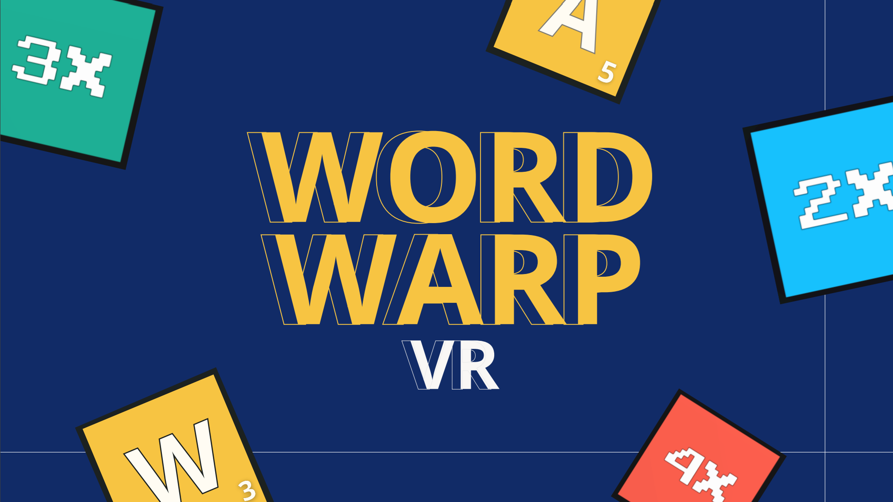
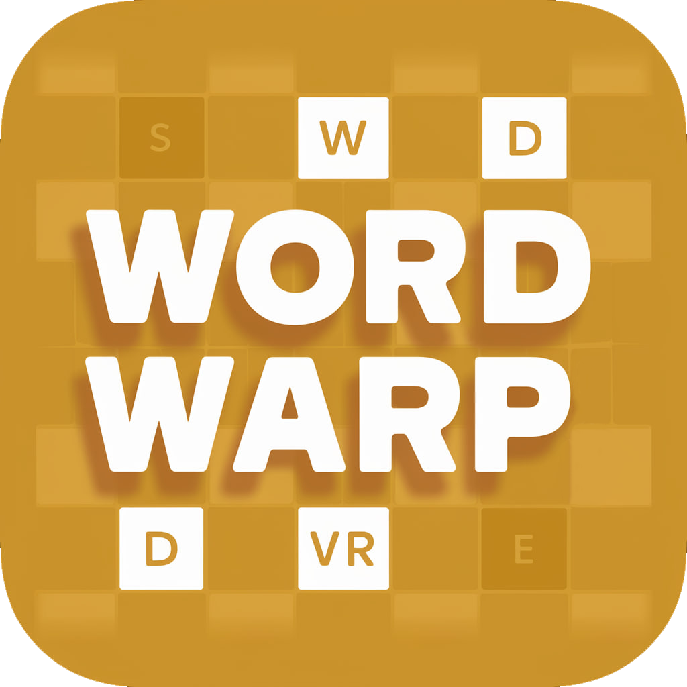
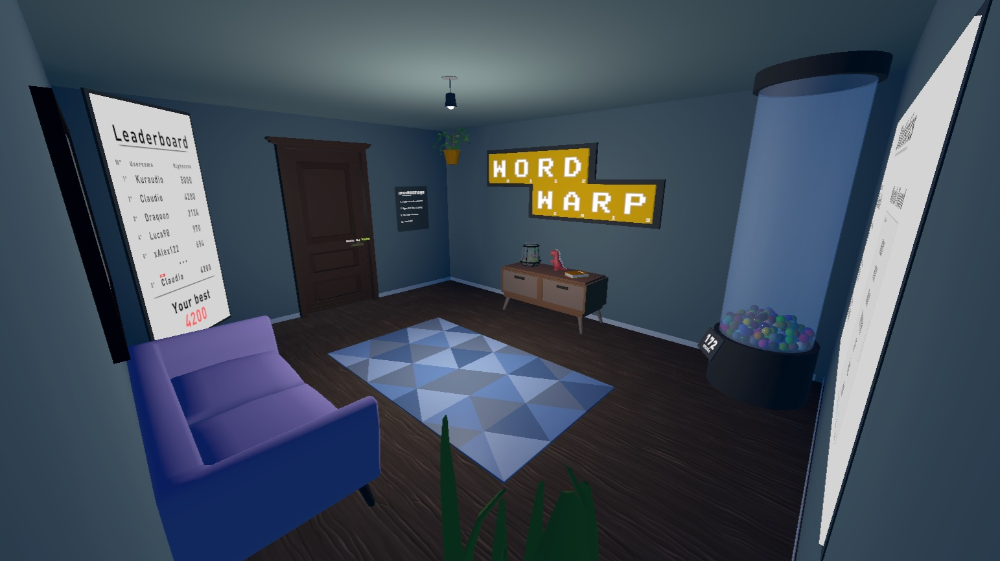
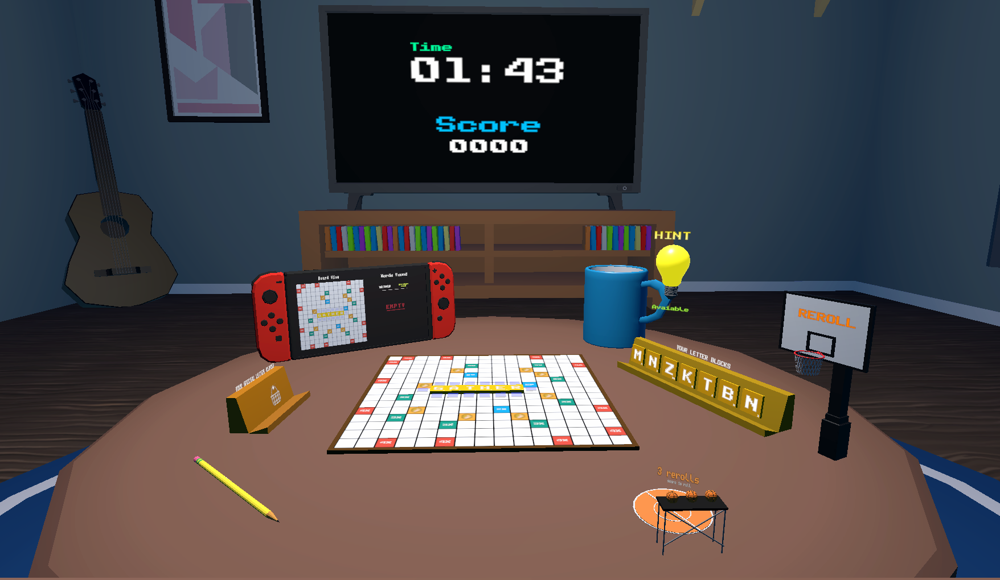

  
  

# WordWarpVR: Unleash the Power of Words

  

  

## ☁️ **Overview**

A <b>Virtual Reality Video Game</b> inspired by [Scrabble](https://en.wikipedia.org/wiki/Scrabble), developed as project for my bachelor’s thesis. The project explores the potential of immersive environments combined with gamification techniques to enhance the <b>learning of the English language</b>.

Designed to provide an engaging and interactive way for users to improve their vocabulary and pronunciation, the game serves both as an educational tool and as a case study for my final thesis exam.

Since this is my first attempt to develope a virtual reality videogame and my first attempt at making a complete video game, it may contain bugs and feel free to give any feedback.

> ❓ For the **source code** or any questions, feel free to contact me.

## 🎯 **Features**
WordWarpVR takes place across two distinct locations: the main <b>HUB</b> and the <b>Game Table</b>, where players are shrunk down to experience the game at a whole new scale.

### HUB
- <b>Tutorial</b>: Learn the game mechanics and get useful tips.
- <b>Online Leaderboard</b>: Compete with other players and track your global ranking.
- <b>Player Statistics</b>: Monitor your progress through the games.
- <b>Translate Gun</b>: Get the translation of any unknown word  (also available during the game).
### Game Table
- <b>Grid and Tile Holder</b>: Organize your tiles and play them on the grid.
- <b>Word Check Menu</b>: Confirm the actual word placed on the grid through your voice.
- <b>Hint System</b>: Get suggestions when you're stuck.
- <b>Shop</b>: Purchase in-game special tiles to increase your score.
- <b>Reroll</b>: Refresh your set of tiles.
- <b>Score and Time</b>: Get track of your score and the remaining time.
- <b>Grid Overview and Word List</b>: Check the grid from a different angle and a list of found words.

> 📖 **More details** can be found in Chapter 4 of [the full thesis](media/Thesis.pdf).  

## 🖥️ **Development Environment**

The project was developed using [Unity](https://unity.com/), with XR Interaction Toolkit and tested using Meta Quest 2.

TTS (Text To Speech) system was developed using [UnityTTS](https://github.com/nixon-voxell/UnityTTS) while the STT (Speech To Text) was developed using [VOSK](https://alphacephei.com/vosk/), both used for the voice confirmation system.

Google [Cloud Firestore](https://firebase.google.com/docs/firestore?hl=en) Database is used for storing the players data and retrieving the leaderboard.

A dataset of over 10,000 English words is integrated into the APK to support the word checking system, which allows the research of any placed word on the grid.
  

## 📖 **Documentation**
You can read the complete [thesis here](media/Thesis.pdf) (🇮🇹), with:
- An introduction to **Virtual Reality** and **Gamification**.
- A detailed description of **WordWarpVR** and its development.
- An **Analysis** of the its effectiveness in terms of Performance and User Experience.

Use Case Diagram of the game flow can be found [here](media/Images/UCD.png)

  

## ⚙️ **Installation**

&nbsp;&nbsp;&nbsp;&nbsp;&nbsp;&nbsp;&nbsp; 

1. **Download the APK** of the [latest release]().
2. Install the APK on your VR headset.
3. Open the app and run **WordWarpVR**.

> ⚠️ Login is not yet implemented (you can change the username directly in the code), and **tested** only on **Meta Quest 2**.

  

## ⚡ **Usage**

### HUB

### Game Table
 

## 🎥 **GIFS**

    

    
     
    
    
    

  

## 👨‍💻 **Author**

The project was developed by [Claudio Buono](https://github.com/ClaudioBuono) in 2024.  
